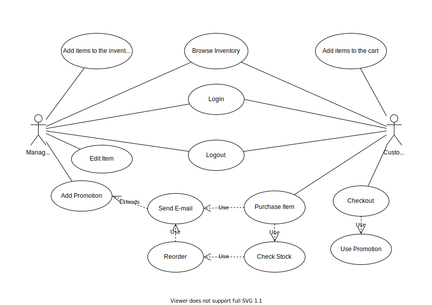
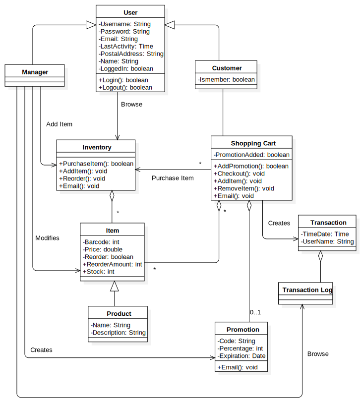

# Software Requirement Specification (SRS)

## Wood Industry E-Commerce System

## 1. Introduction

The Software Requirement Specification is designed to document and describe the agreement between the customer and the developer regarding the specification of the software product requested. It's primary purpose is to provide a clean and descriptive "statement of user requirements" that can be used in further development of the software system. This document is broken into a number of sections used to logically separate the software requirements into easily referenced parts.

This Software Requirements Specification aims to describe the Functionality, External Interfaces, Attributes and Design Constraints imposed on Implementation of the software system described throughout the rest of the document.

### 1.1 Purpose

Defining and describing the functions and specifications of the E-Commerce System is the primary goal of this Software Requirements Specification (SRS). The intended audience of this specification is the costumer, as well as the examination board, who will examine
my thesis.

### 1.2 Scope

The software system being produced is called Wood Industry E-Commerce System. This system focuses on the company and applications, which allow for online sale and marketing of products.

The Wood Industry E-Commerce System will allow any user to create an account to become a member. The customer through the process of account creation, will have the option to become a member of the site. The system will allow costumers to browse , search , select and add products to a shopping cart. Then, provided the shopping cart doesn't empty, check out products. The system also allows a manager to manage the inventory with full create, update, retrieve and delete (CRUD) functionality. The system allows the manager to interact with the promotion system that handles percentage-off promotions that can be applied to member's orders. The system has full email capabilities; the automated email functionality will be used to send information about the check out and the promotions to the customer.

### 1.3 Definitions, Acronyms and Abbrevations

|Definition|Description|
|---|---|
| CRUD | Create, Retrieve, Update, Delete |
| Checkout | The process a costumer goes through to purchase an item|
| Customer  | A person that is a user of the system |
| Inventory | An object that holds items available for purchase by the customer |
| Item | An individual entity in the inventory which has several descriptive attributes|
| Manager | A single person that has abilities to create, retrieve, update, delete item in the shop|
| Member |  A person that is a customer of the system and has requested to be sent promotions |
| Promotion | An item-wide percentage-off price discount applied to a member's order |
| Reorder | The system process that automatically orders new stock of an item |
| Reorder threshold | The numeric value of an item's stock that must be reached before the reorder of the item |
| Shopping cart | An object that lists the customer's selected items and gives them an option to check out|
| Stock | The quantity of any particular item the inventory has on hand|

### 1.4 Overview

Lorem ipsum dolor sit amet, consectetur adipisicing elit

## 2. Overall Description

### 2.1 Product Perspective

The required E-Commerce is an online store which supports a number of functions for both the consumer and the store's manager.

The website must be available to anyone using an internet browser.

### 2.2 Product Functions

The system will provide a number of functions.

* Maintain data associated with the inventory (collection of items)
  * An item has an id, name, description and price
  * The inventory also keep track of the the stock of each item
* Allow any costumer to become a member
* Show the listing of the available products
* Allow customers and managers to log in and out of the system
* Allow customer to search products
  * Display all the matching products
  * Notify the customer when no matching product found
* Shopping cart
  * Anyone is able to add one or more product to it
* Checkout
  * Checkout is available for anyone, not just for members
  * Member customers may enter promotion code
  * Only one promotion code may be used per purchase
    * The promotion is a fixed percentage discount that is to be applied to the entire order.
    * The discount is specified by the manager.
  * Log/record the transaction
* Allow manager to specify a stop-order for an item
  * Each item has its own stop-order status
* Notify manager when products need to be reordered
  * When the quantity of an item falls below the threshold, the manager gets notified that the item needs to be reordered
    * One exception is if the manager has already specified a stop-order for this item
* Allow manager to update stock quantities
* Allow manager to change any product's price
* Allow manager to view transaction logs
* Allow manager to create promotions
   * When a promotion is created, it is emailed to all member customer via the email address on account

### 2.3 User Characteristics

The user is simply anyone, who looking for wood products (beds, boats, seating, shelves, cabinets, tables, custom built wood products). It is assumed that the user is familiar enough with a computer to operate the browser and capable of browsing to, from and within websites.

### 2.4 Constraints

### 2.5 Assumptions and dependencies

Assumptions:
* The manager cannot be a customers
<!-- * Any user cannot edit their account information -->

### 2.6 Approportioning of Requirements

* Verifying the email address provided by a user.
* Support for visually impaired  users

## 3. Specific Requirements

1. Restrictions
    1. User Side
    	1. Software
        	1. Internet Browser
    1. System Side
    	1. Software
        	1. Web-based application
        	1. Database storage system
1. Data Structure
	1. Products has these attributes
    	1. Unique ID
    	1. Name
    	1. Description
    	1. Price
    	1. Reorder Threshold
    	1. Stop-order Boolean
    	1. Stock
 	1. Customer has these attributes
    	1. Unique username
    	1. Name
    	1. Password
    	1. Email Address
    	1. Postal Address
    	1. Member/Not member Boolean
 	1. Manager has these attributes
    	1. Username
    	1. Password
    	1. Email Address
 	1. Order log entries has these attributes
    	1. Unique ID
    	1. Username of costumer
    	1. Time transaction took place
    	1. Date transaction took place
    	1. Listing of the contents in costumer's cart
1. System
	1. Browse Inventory
    	1. Organization
        	1. Items listed on single page
        	1. Each item listing contains
          		1. Name
          		1. Description
          		1. Price
        	1. Listing can be sorted by name or price
    	1. Interaction
        	1. Button to add particular item to shopping cart
  	1. Search Inventory
    	1. Search available only by the name of item
  	1. Create, Update and Delete functions (CRUD)
    	1. Only the manager is allowed to modify the inventory
    	1. Manager have an interface to:
        	1. Create an item
        	1. Update an item
        	1. Update the stock of a particular item
        	1. Delete items from inventory
        	1. Create a new promotion
        	1. Review current inventory
  	1. Shopping Cart
    	1. Logged in
        	1. Can add items to the cart
        		1. If the item is not in stock this option is not available
    	1. Not logged in
        	1. Can add items to the cart
          		1. If the item is not in stock this option is not available
  	1. Checkout procedure
    	1. User must successfully use shopping cart before this
    	1. Checkout page consists of
        	1. An overview of the purchase
        	1. Text boxes to hold shipping details
        		1. If the user is logged in, then these boxes are filled
        	1. A text box for promotion code
        	1. A text box to hold the credit card number
        	1. A button to complete the order
    	1. Order details sent via email after the checkout has completed
    	1. On order completion the inventory is decremented based on the items purchased by customer
  	1. Authentication System
    	1. User Levels
        	1. Manager
        		1. Only one in the system
          		1. Hardcoded
          		1. Not able to order
        	1. Customer
          		1. Unlimited in the system
          		1. Open creation
          		1. Unlimited order
    	1. Account Creation
        	1. Everyone is allowed to create an Account
        	1. Required informations listed in the Data Structure section (2.ii)
    	1. Login and logout
        	1. There is no lost-password recovery
        	1. Logging in allows one to logout
        	1. There is a 30 minute session time out after a logged in user will be logged out automatically
  	1. Promotions
    	1. Specifications
        	1. Percentage-off type promotion
        	1. Applies to entire order
        	1. Expiration occurs at manager specified date
        	1. Only one promotion can be applied to an order
        	1. Non-member users cannot apply promotions to order
    	1. Creation
        	1. Promotion created by manager
        	1. Each promotion has a unique ID
        	1. Email containing promotion sent to all member
    	1. Deletion
        		1. Promotions are deleted automatically when the expiration date passed
  	1. Automated Reorder
    	1. Specifications
        	1. Manager sets reorder threshold on every item
        	1. If item reaches the reorder threshold, an email is sent to inform the manager of the item's status and the system automatically reorders the item
          		1. If the item has a stop-order applied to it, it will not automatically reorder
        	1. The manager can increase the stock of an item using the manager's account
  	1. Order Logging
    	1. Specifications
        	1. Required informations listed in the Data Structure section (2.iv)
        	1. The manager can view all past transactions from all users
        	1. Log entries are generated when a user successfully checks out their shopping cart

## Modeling Requirements

### Use Case Diagram

Use Cases

|Use Case: |Login|
|---|---|
|**Actors:**|Manager, Customer|
|**Description**|The user can enter in their username and password in order to use promotions|
|**Use:**|None|
|**Extends:**|None|
|**Use Cases:**|None|

|Use Case: |Logout|
|---|---|
|**Actors:**|Manager, Customer, System|
|**Description**|The manager or customer have the option to logout. If the user is inactive for a given amount of time, then the user will be logged out by the system.|
|**Use:**|None|
|**Extends:**|None|
|**Use Cases:**|User must have completed the login use case|

|Use Case: |Browse Inventory|
|---|---|
|**Actors:**|Manager, Customer|
|**Description**|All the products in the inventory are listed on a page.|
|**Use:**|None|
|**Extends:**|None|
|**Use Cases:**|None|

|Use Case: |Add Items to Cart|
|---|---|
|**Actors:**|Customer|
|**Description**|Allows the customer to place items to the cart for later purchase.|
|**Use:**|None|
|**Extends:**|None|
|**Use Cases:**|None|

|Use Case: |Add Item|
|---|---|
|**Actors:**|Manager|
|**Description**|Allows the manager to add additional products to the inventory|
|**Use:**|None|
|**Extends:**|None|
|**Use Cases:**|Manager must have completed login use case|

|Use Case: |Edit Item|
|---|---|
|**Actors:**|Manager|
|**Description**|Allows the manager to edit all of the attributes of a  particular item in the inventory|
|**Use:**|None|
|**Extends:**|None|
|**Use Cases:**|Manager must have completed the login use case|

|Use Case: |Add Promotion|
|---|---|
|**Actors:**|Manager|
|**Description**|Allows the manager to add promotions. This will email all members to inform them of the new promotion|
|**Use:**|None|
|**Extends:**|None|
|**Use Cases:**|Manager must have completed login use case|

|Use Case: |Checkout|
|---|---|
|**Actors:**|Customer|
|**Description**|This takes the items in the customers shopping cart and processes them for purchase.|
|**Use:**|Use Promotion|
|**Extends:**|None|
|**Use Cases:**|None|

|Use Case: |Use Promotion|
|---|---|
|**Actors:**|Customer|
|**Description**|If the user is a member they have the option to enter promotion code that will take off a percentage from the total.|
|**Use:**|None|
|**Extends:**|None|
|**Use Cases:**|Customer must have completed the login and the checkout use cases|

|Use Case: |Purchase Item|
|---|---|
|**Actors:**|Customer|
|**Description**|Happens when the user presses the order button in checkout. This decrements the stock of all items within the order, email the user, create a log of the transaction and checks the stock to see if a reorder needs to take place|
|**Use:**|Send Email, Check Stock|
|**Extends:**|None|
|**Use Cases:**|Customer must have completed checkout use case|

|Use Case: |Check Stock|
|---|---|
|**Actors:**|System|
|**Description**|Checks to see if stop-order is on for a particular item and if it is checks to see if the amount in stock is below the reorder threshold. If it is then it will reorder.|
|**Use:**|Send Email, Reorder|
|**Extends:**|None|
|**Use Cases:**|None|

|Use Case: |Reorder|
|---|---|
|**Actors:**|System|
|**Description**|Reorders a particular item and mails the manager|
|**Use:**|None|
|**Extends:**|None|
|**Use Cases:**|None|

|Use Case: |Send Email|
|---|---|
|**Actors:**|System|
|**Description**|This is called by a variety of use cases when an email nedds to be sent|
|**Use:**|None|
|**Extends:**|Add |
|**Use Cases:**|None|

### Class Diagram

